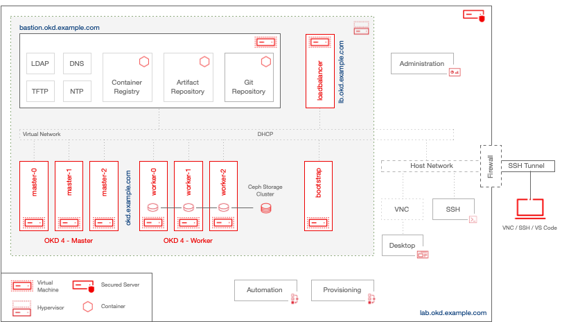

   

  

  

# OKD-LAB: Controlled Environment for OKD4 experiments

You plan a dedicated machine to install and experiment with the [Community Distribution of Kubernetes](https://www.okd.io/), maybe even on an rented root server in the wild wild world?

You want to manage your OKD cluster and applications the GitOps way? 

It is probably worth the time to read a little further....

Naturally when we do some experiments we can destroy our cluster and bring it in a state we can't fix or recover. From this point of view we should try to keep complex things __simple and repeatable__. This is what this lab wants to address to.

You can expect a fully virtualized small IT center with everything you need to install a `User Provisioned Infrastructure (UPI)` of [OKD4](https://www.okd.io/) based on [KVM](https://www.linux-kvm.org). 

Additionally you get mostly all you need for a development environment including git, artifact management, private container registry, centralized user registry..... everything pre-configured and tightly integrated.

* * *

## OKD-LAB: Overview

* * *

## Prerequisites

- Dedicated root server (recommended)
- Internet access*
- Git client
- SSH / VNC client
- [Visual Studio Code](https://code.visualstudio.com/) (optional but highly recommended!)

This project is being developed on a [Hetzner](https://www.hetzner.com) machine with the following specs:

- AMD Ryzen 9 3900 12-Core
- 128 GB DDR4 ECC
- 2 x 1,92 TB NVMe SSD

You can do it with less but than you have to [tweak some settings and/or strip off some optional services](docs/02_sizing.md).

*Please Note! __NO proxy support__ in this version! Following soon.

* * *

## Installation

__95% of the installation process is copy&paste. No deep Linux or OKD4/Kubernetes skills needed!*__

- [Install CentOS 8.4](docs/00_install_centos.md)
- [Setup - lab.okd.example.com](docs/01_setup_lab.md)
- [Provision infrastructure](docs/02_provision_infrastructure.md)
- [Install and configure OKD4](docs/03_install_okd.md)
- [Day-1 cluster configurations the Gitops way](docs/03_install_okd.md)

*The missing 5% is a guided [CentOS 8.4](docs/00_install_centos.md) Linux installation and using a Firefox to create some tokens.

* * *

## What's in the box?

Watch a [animated gif at dropbox](https://www.dropbox.com/s/ryehh25b5s9yfij/OKD-LAB.gif?dl=0) and open pandorra's box.

Operatiing system and virtualization:

- [Centos 8.4](https://www.centos.org/)
- [KVM](https://www.linux-kvm.org) / [QEMU](https://www.qemu.org)

Automation and provisioning:

- [Terraform](https://www.terraform.io)
- [Packer](https://www.packer.io/)
- [Ansible](https://www.ansible.com/)

Bastion (KVM):

- [Centos 8.4](https://www.centos.org/)
- [OKD4](https://www.okd.io) - UPI installation environment:
  - OKD4 Registry Mirror
  - Fedora CoreOS Mirror
  - NTP
  - DNS
  - DHCP
  - TFTP
- [Project Quay](https://www.projectquay.io/) with [Clair](https://github.com/quay/clair)
- [Podman](https://podman.io/), [Skopeo](https://github.com/containers/skopeo), [Buildah](https://github.com/containers/buildah/) (no Docker!)
- [389 Directory](https://directory.fedoraproject.org/)
- [GitLab](https://about.gitlab.com/)
- [Artifactory](https://jfrog.com/open-source/)

Load Balancer (KVM):

- [Centos 8.4](https://www.centos.org/)
- [HAProxy](https://www.haproxy.org/)

[OKD4](https://www.okd.io) (KVMs):

- Bootstrap
- 3x Master
- 3x Worker

* * *

          

## What do you get from the OKD / Kubernetes world?

Terraform/Ansible managed:

- 3x Master and 3x Worker
- Chrony time services configured on all `master` and `worker` nodes
- Trusted private Project Quay container registry 
- Trusted custom Certificate Authority and SSL certificates for Web console, Router, API, LDAP, Project Quay, Podman etc.
- LDAP(s) authorization provider with:
  * Administrators: `admin`, `lab` in the `cluster-admin` role
  * Team Members: `awesome-admin`, `awesome-developer`
- Enabled `Image Pruner` and disabled `Samples Operator`

Argo CD (GitOps) managed:

- Operators and instances:
  * OpenShift Logging
  + OpenShift Elastic Search
  * Quay Container Security
  * Grafana Operator
- Storage:
  * [Rook Ceph](https://github.com/rook/rook)
- Argo Project:
  * [ArgoCD](https://github.com/argoproj/argo-cd)
  * [Argo ApplicationSet ](https://github.com/argoproj-labs/applicationset)
  * [Argo Workflows](https://github.com/argoproj/argo-workflows)
  * [Argo Events](https://github.com/argoproj/argo-events)
  * [Argo Rollouts](https://github.com/argoproj/argo-rollouts)
- Tekton:
  * [Tekton Pipelines](https://github.com/tektoncd/pipeline)
  * [Tekton Triggers](https://github.com/tektoncd/triggers)
  * [Tekton Dashboard](https://github.com/tektoncd/dashboard)
  * [OpenShift TektonCD Catalog](https://github.com/openshift/tektoncd-catalog)
- Secret Management:
  * [Sealed Secrets](https://github.com/bitnami-labs/sealed-secrets)
- Container Build:
  * [Shipwright](https://github.com/shipwright-io/build)
- Security:
  * [Kyverno](https://github.com/kyverno/kyverno/)
  * [Policy Reporter](https://github.com/kyverno/policy-reporter)
* * *

## Security

Especially with servers available in the wild wild world some kind of security makes sense!

For this reason:
  
  * A Firewall is running on this lab and only SSH (port 53) is allowed on the external interface.
  * Only SSH PubkeyAuthentication is allowed.
  * Only necessary services are enabled.
  * Except SSH all network services are bound to `localhost`.
  * Virtual network is not directly reachable from the wild world.
  * Visual Studio Code and VNC is only available via SSH tunnel.

If you go the Hetzner path [additional security](docs/hetzner.md) is possible and recommended.

* * *

## A few words

This guide is not about installing and maintaining Linux at the highest possible levels. It's not about being the best of class automation expert and it's a controlled environment with intentionally 99% static settings. But if you know what you do, you can change and expand  everything with ease and apply it to your needs. Have fun!

Thanks to all in the Open Source Community and especially to [@cgruver](https://github.com/cgruver) for [inspiration](https://github.com/cgruver/okd4-upi-lab-setup) and help!

* * *

## License

OKD-LAB is released under the [Apache 2.0](http://www.apache.org/licenses/LICENSE-2.0.html) license. See the [LICENSE](https://github.com/disposab1e/okd-lab/blob/master/LICENSE) file for details. Some components may be licensed differently - consult individual vendors and repositories for more.
