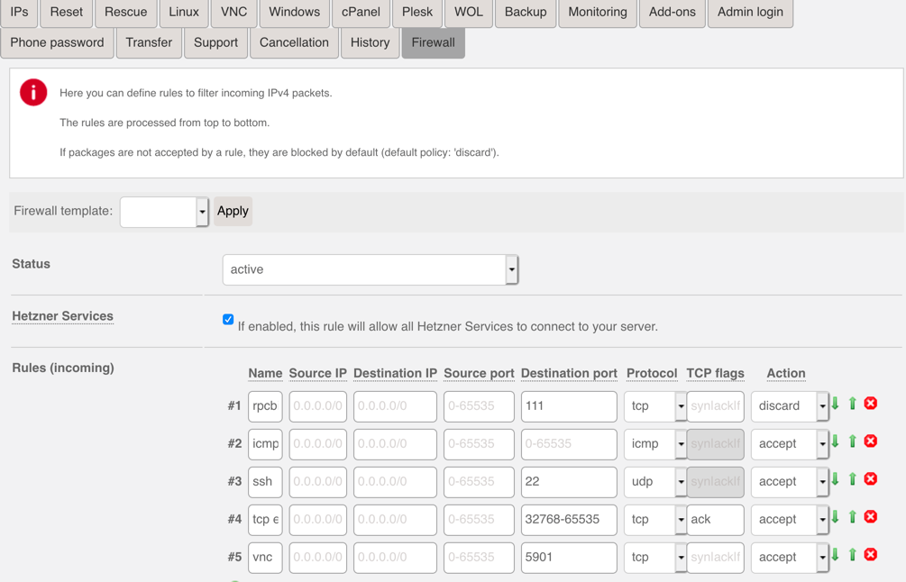
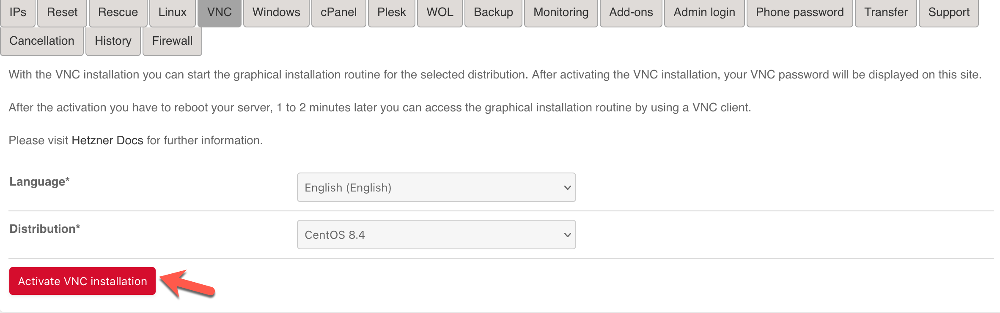
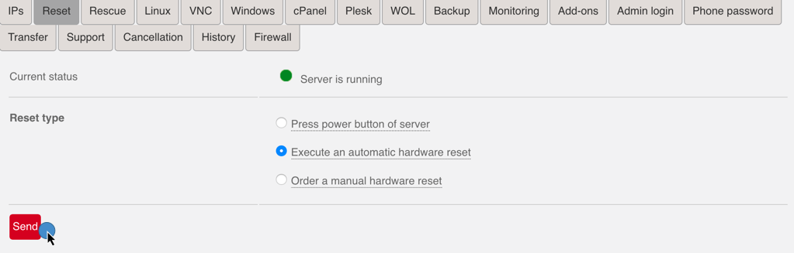
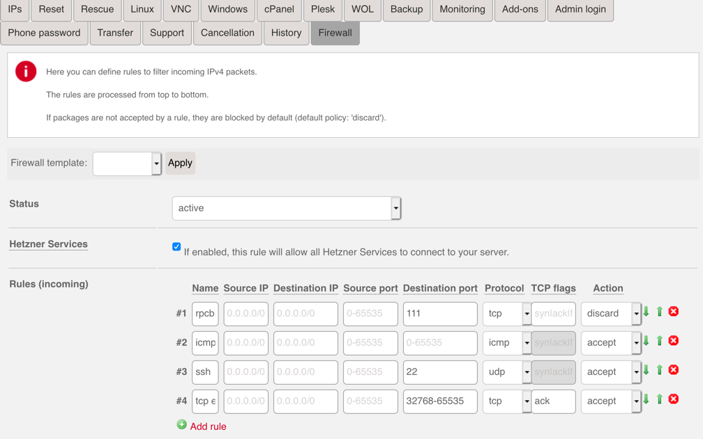

# Start CentOS 7.8 installation with Hetzner

< [Install Centos 7.8](00_install_centos.md)

* * *

## Prepare Firewall

Only SSH and ICMP will be allowed at the end. However, during VNC installation we additionally need an open VNC Port `5901`. This port will be removed after the VNC installation.



## Activate VNC installation

Don't forget to remember your password!



## Initiate Reboot



## Connect with VNC

Example:

```bash
[home@home]

vncviewer YO.U.R.IP:5901

```

## Remove VNC port from Firewall

After successful CentOS 7.8 installation you can remove the VNC port from the firewall.



* * *

Next> [Install CentOS 7.8](00_install_centos.md)
