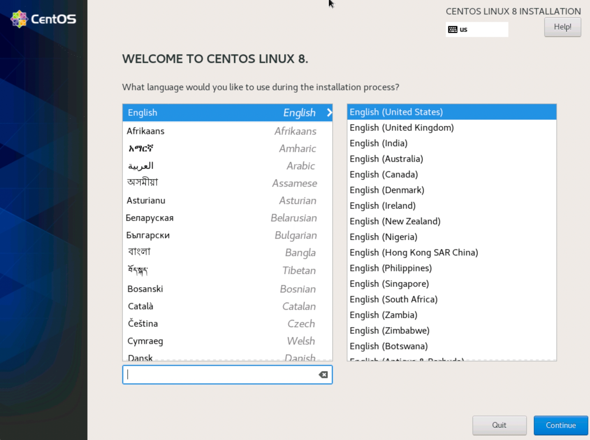
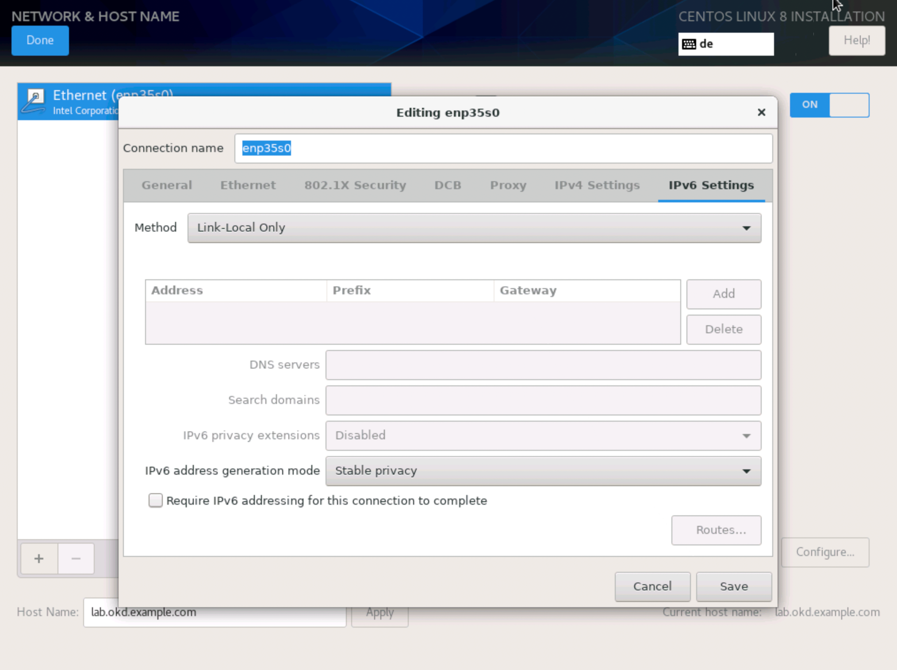
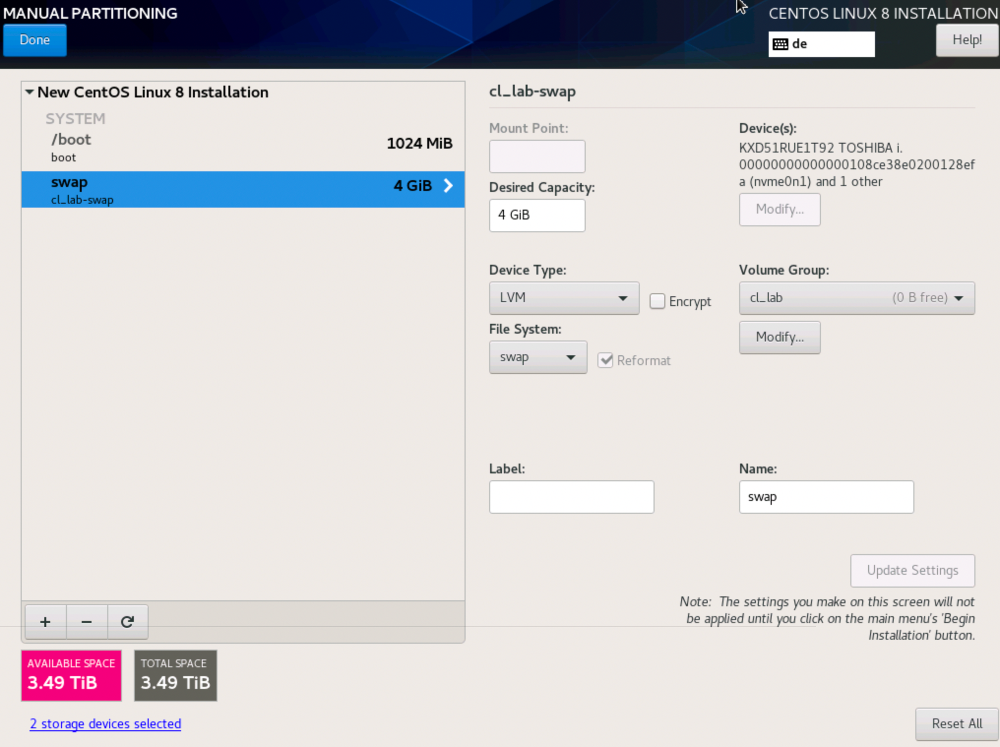
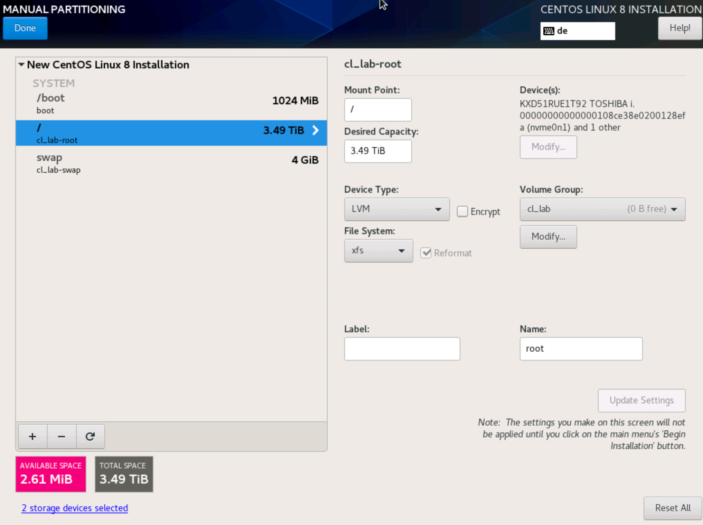
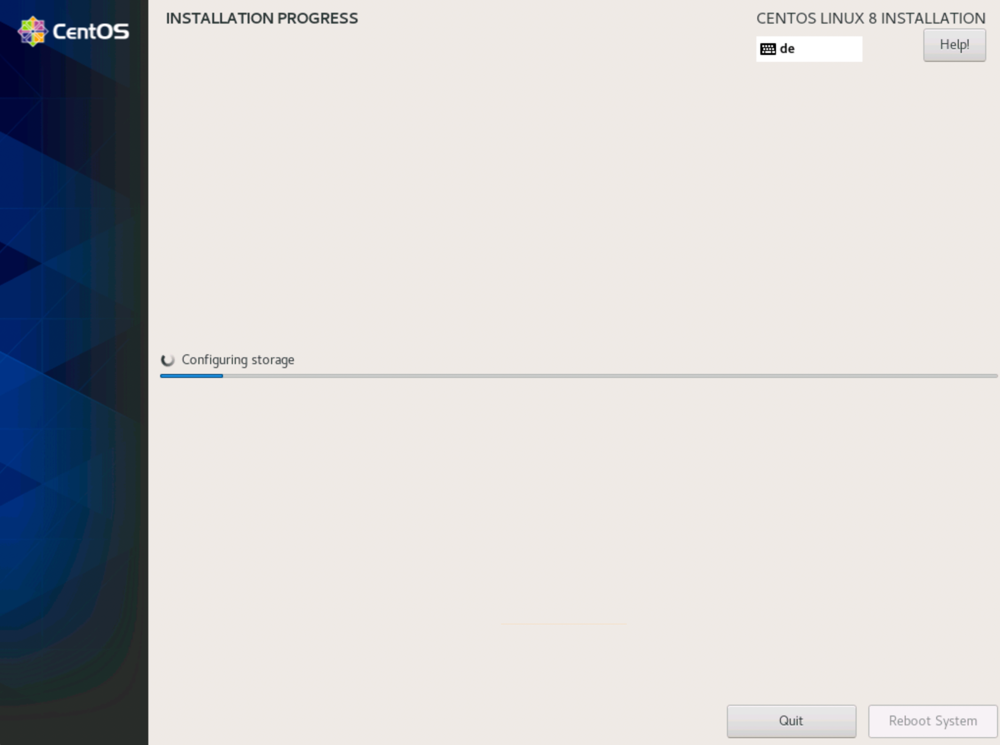

# Install CentOS 8.4

These Screenshots will guide you through a typical CentOS 8.4 installation. If you follow the Hetzner path, you can easily start a [CentOS 8.4 installation with Hetzner](hetzner.md).

## Welcome to Centos

Choose your preferred installation language.

## Installation Summary

## Keyboard Layout

Choose your preferred keyboard layout.

## Date & Time

Choose your timezone.

## Kdump

Disable kdump for now, it can be activated later if really needed.

## Security Policy

Don't apply any security policies.

## Network & Hostname

Hostname: `lab.okd.example.com`

Attention! __DO NOT__ use a different hostname!

Set IPv6 to `Link-Lokal Only`.

## Software Selection

- Minimal Install

## Installation Destination

This example assumes two hard drives for a `software raid` system with LVM. Apply it to your needs.

### Manual partitioning

`Click here to create them automatically` is a good starting point.

### Boot partition

Remove everything instead of the `boot` partition. Change the boot partition to `RAID0`.

### Swap partition

### Configure Volume Group for swap & root partitions

Don't forget to also choose `RAID0` here.

### Installation Summary

## Root Password

### Create User

Attention! __DO NOT__ use a different User name!

### Begin Installation

## Reboot

* * *

Next > [Setup - lab.okd.example.com](01_setup_lab.md)
