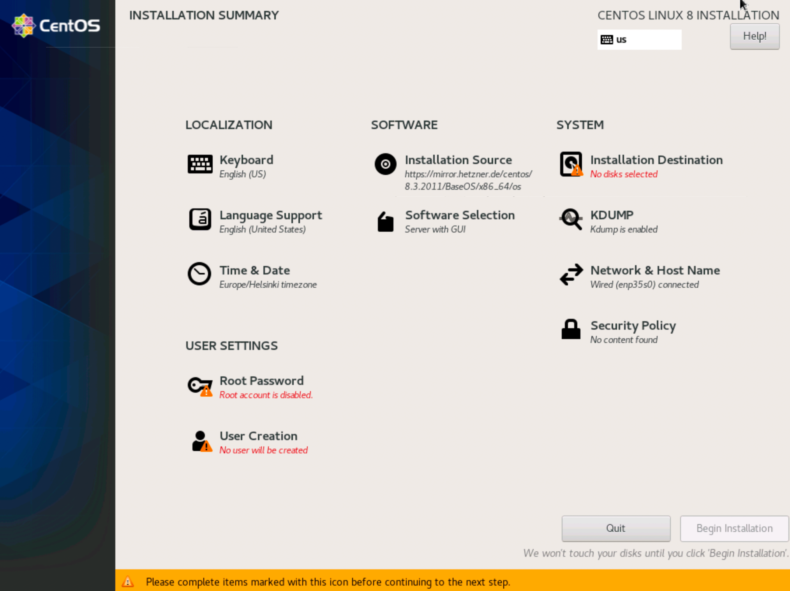
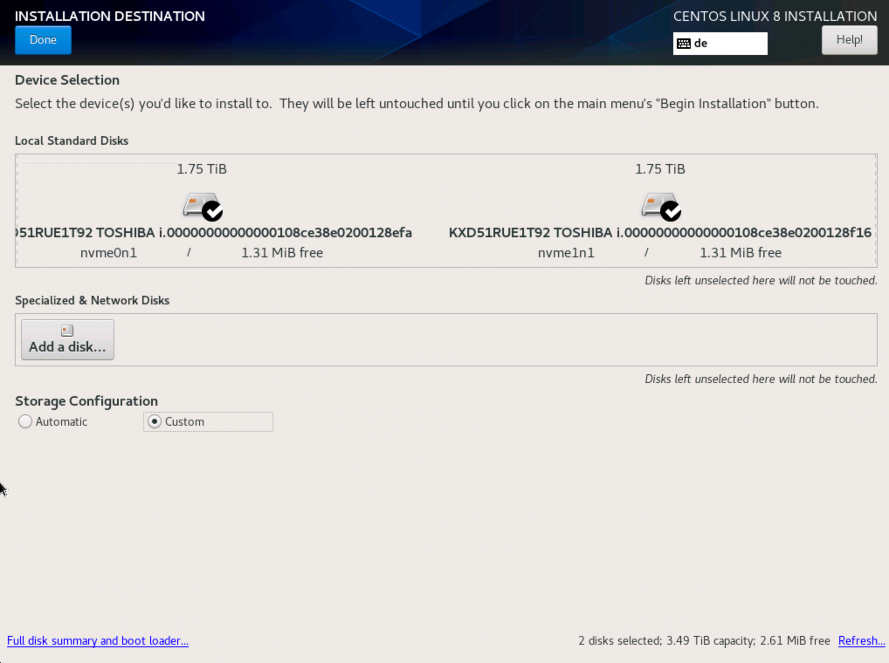
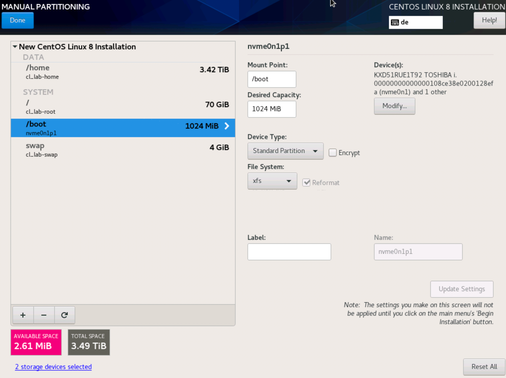
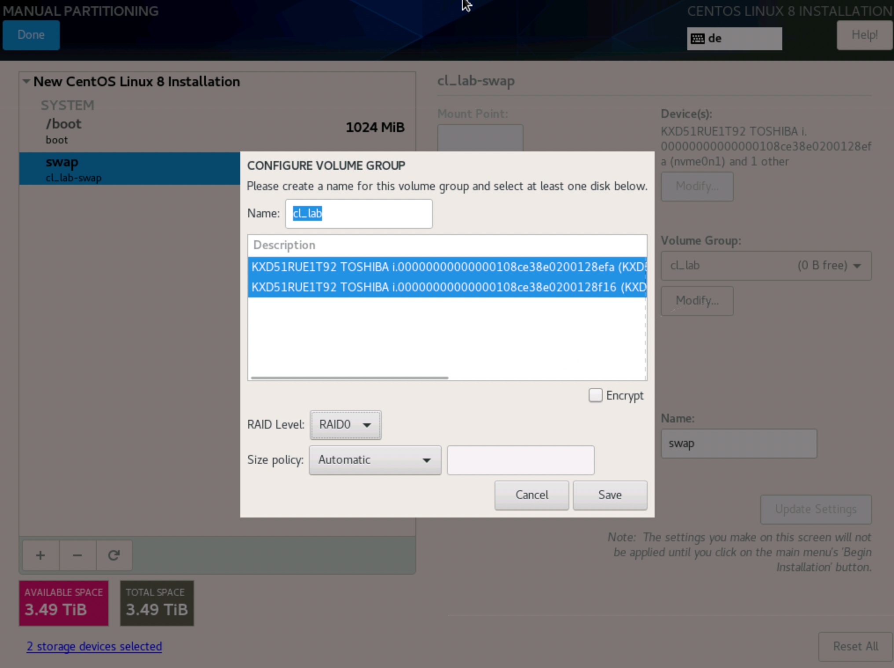
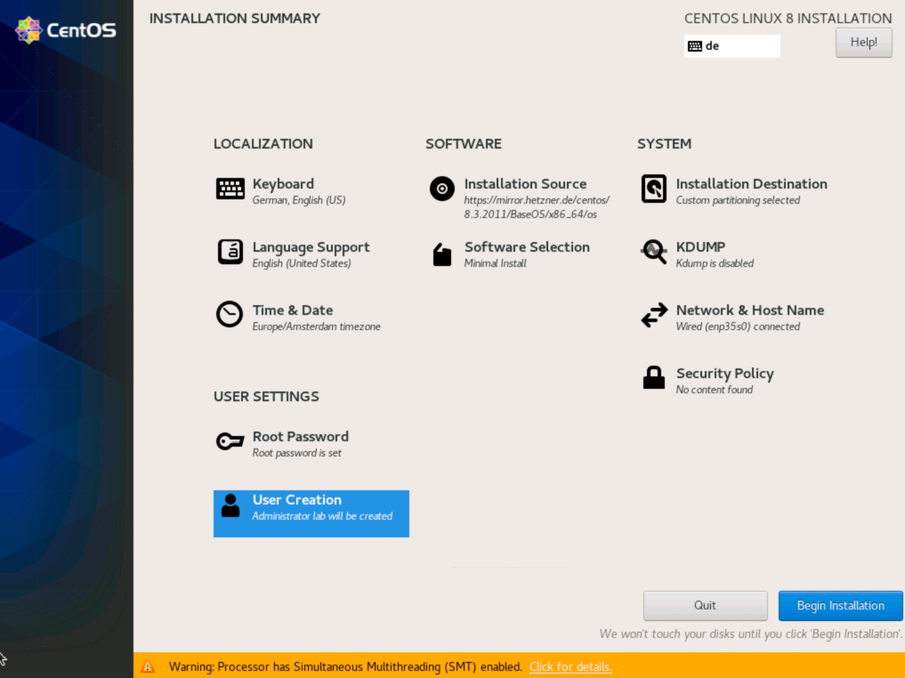
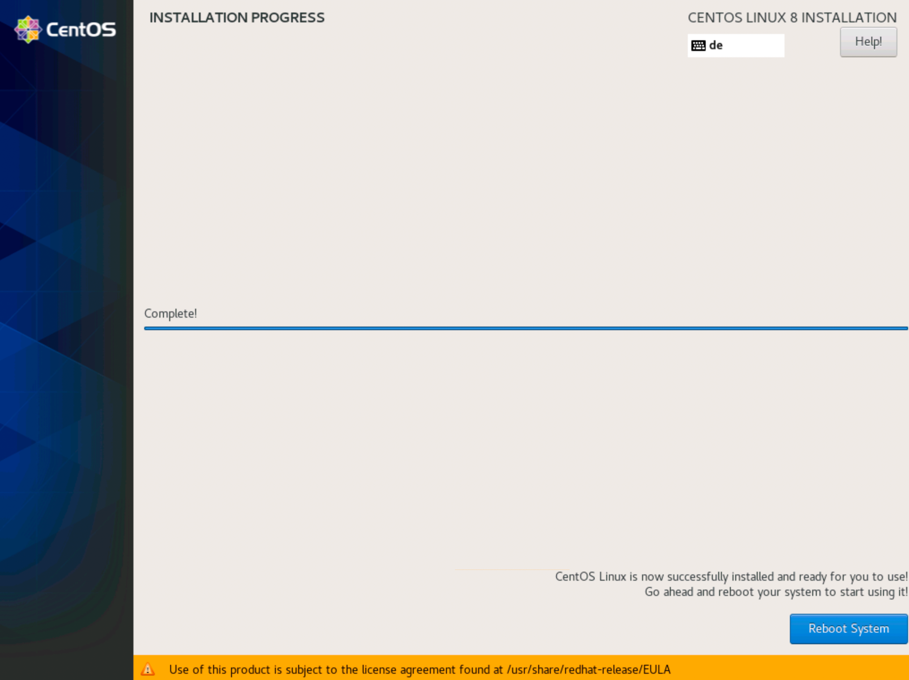

# Install CentOS 7.8

These Screenshots will guide you through a typical CentOS 7.8 installation. If you follow the Hetzner path you can easily start a [CentOS 7.8 installation with Hetzner](00_hetzner.md).

## Welcome to Centos

Choose your preferred installation process language.

## Installation Summary

## Keyboard Layout

Choose your preferred keyboard layout.

## Date & Time

Choose your timezone and add a custom NTP server. Disable the default NTP servers.

## Kdump

Disable kdump for now, it can be activated later if really needed.

## Security Policy

Don't apply any security policies.

## Network & Hostname

Hostname: `lab.okd.example.com`

Attention! __DO NOT__ use a different hostname!

Diable (ignore) IPv6 so you don't have to care about IPv6 network security.

## Software Selection

- Virtualization Host
  - Virtualization Platform
  - System Administration Tools

## Installation Destination

This example assumes you have two hard drives available and you want to build a software raid system with LVM. Apply it to your needs. We recommend only boot, swap and root partitions typically based on LVM.

### Manual partitioning

`Click here to create them automatically` is a good starting point.

### Boot partition

Remove everything instead of the `boot` partition. Change the boot partition to `RAID0`.

### Swap partition

### Configure Volume Group for swap & root partitions

Don't forget to also choose `RAID0` here.

### Root partition

## Begin Installation

## User Settings

### Root Password

### Create User

Attention! __DO NOT__ use a different User name!

## Reboot

* * *

Next > [Install - lab.okd.example.com](01_install_lab.md)
