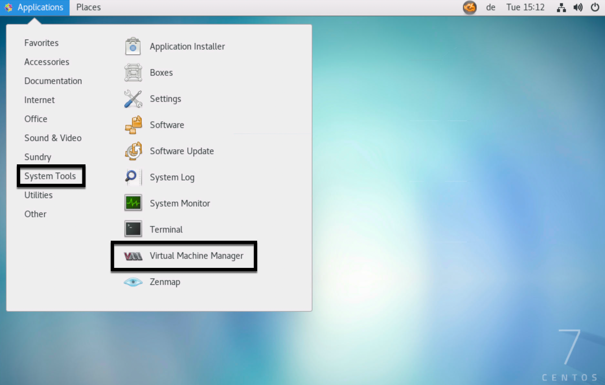
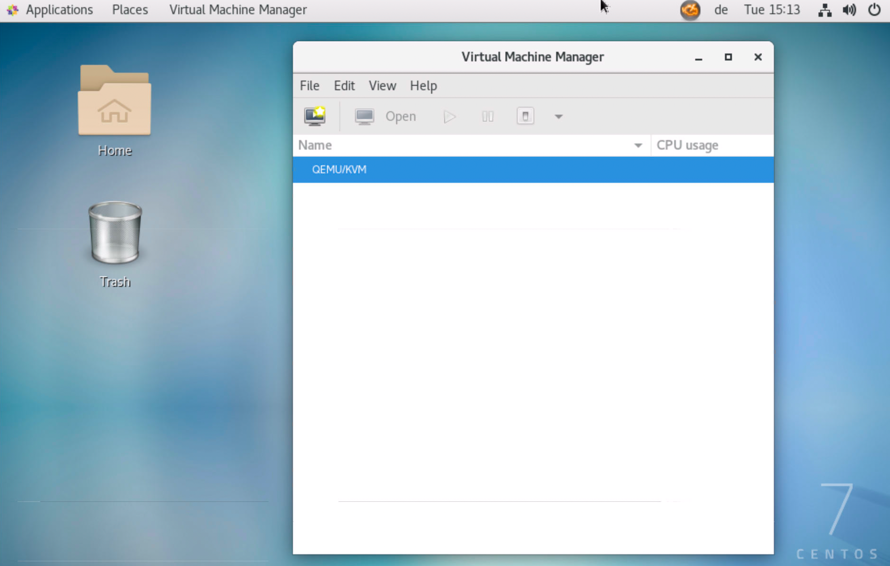

# Provision infrastructure

< Prerequisite: [Setup - lab.okd.example.com](01_setup_lab.md)

* * *

## Clone `okd-lab`

```bash
[lab@lab]

mkdir ~/github
cd ~/github
git clone https://github.com/disposab1e/okd-lab.git

```

...or connect with [Visual Studio Code](https://code.visualstudio.com/) and the [Remote - SSH extension](https://marketplace.visualstudio.com/items?itemName=ms-vscode-remote.remote-ssh) and clone from there.

## Initialize default virtualization environment

Switch to VNC and GNOME Desktop and start the "Virtual Machine Manager" graphical user interface.

- Activities - Show Applications - Virtual Machine Manager

This small application is a great viewer for the next steps __and__ additionally a convenient way to initialize and check the default virtualization environment. It will also create the default network and storage pool.





## Configure `lab`

Please change these settings to fit your needs!

`[ lab@lab ~/github/okd-lab/ansible/vars/vars.yaml ]`

```yaml

    # Your/Provider DNS Server
    okd_lab_bind_forwarder: '213.133.98.98'

    # Your/Provider NTP Server
    okd_lab_ntp_forwarder: 'ntp1.hetzner.de'

```

## Prepare `lab`    

Install Packer, Terraform, Ansible Collections, generate SSH key for user `lab`, configure chronyd and use custom CA

```bash
[lab@lab]

ansible-playbook -K ~/github/okd-lab/ansible/lab/lab.yml

Password: root

```

## Sizing the `lab`

__It is time to think about sizing! Please [check the defaults and change them as needed](sizing.md).__

## Build `bastion` VM

```bash
[lab@lab]

cd ~/github/okd-lab/packer/bastion
packer build -force bastion.json
mv ~/github/okd-lab/packer/bastion/output-bastion/bastion.qcow2 /tmp/

```
This will take some time! Be patient!

## Build `lb` VM

```bash
[lab@lab]

cd ~/github/okd-lab/packer/lb
packer build -force lb.json
mv ~/github/okd-lab/packer/lb/output-lb/lb.qcow2 /tmp/

```

This will take some time! Be patient!

## OKD - KVM Network

```bash
[lab@lab]

ansible-playbook -K ~/github/okd-lab/ansible/lab/network.yml

Password: root

```

## Provision `bastion` host

```bash
[lab@lab]

cd ~/github/okd-lab/terraform/bastion
terraform init
terraform apply -auto-approve

```

This will take some time! Be patient!

## Provision `lb` host

```bash
[lab@lab]

cd ~/github/okd-lab/terraform/lb
terraform init
terraform apply -auto-approve

```

This will take some time! Be patient!

## Stroll around

It is time to reap the first fruits.

Start Firefox and import bookmarks from `~/github/okd-lab/bookmarks/bookmarks.json`

Have a look at the [Appendix](appendix.md) for more detailed information.

* * *

Next > [Install OKD4](03_install_okd.md)
