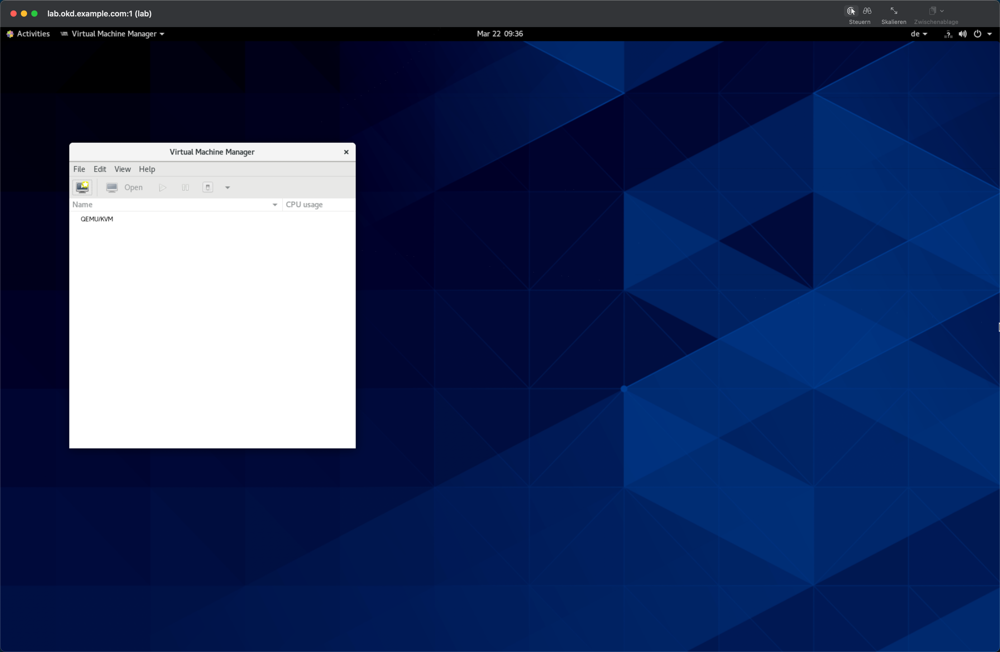

# Provision infrastructure

< Prerequisite: [Install - lab.okd.example.com](01_install_lab.md)

* * *

## Clone `okd-lab`

```bash
[lab@lab]

cd ~/
git clone https://github.com/disposab1e/okd-lab.git

```

Or connect with [Visual Studio Code Insiders](https://code.visualstudio.com/insiders/) and the [Remote - SSH extension](https://marketplace.visualstudio.com/items?itemName=ms-vscode-remote.remote-ssh) and clone from there.

## Initialize and view default virtualization environment

Switch to VNC and GNOME Desktop and start the "Virtual Machine Manager" graphical user interface.

- Applications - System Tools: Virtual Machine Manager

This small application is a great viewer for the next steps __and__ additionally a convenient way to  initialize the default virtualization environment.




## Install automation software

Install Packer, Terraform and generate some SSH keys.

```bash
[lab@lab]

ansible-playbook -K ~/okd-lab/ansible/lab/automation.yml

```

Install Packer, Terraform and generate some SSH keys.

## Sizing the `lab`

__It is time to think about sizing! Please [check the defaults and change them as needed](02_sizing.md).__


## Build `bastion` VM

```bash
[lab@lab]

cd ~/okd-lab/packer/bastion
packer build -force bastion.json
mv ~/okd-lab/packer/bastion/output-bastion/bastion.qcow2 /tmp/

```

## Build `lb` VM

```bash
[lab@lab]

cd ~/okd-lab/packer/lb
packer build -force lb.json
mv ~/okd-lab/packer/lb/output-lb/lb.qcow2 /tmp/

```

## KVM Network

```bash
[lab@lab]

ansible-playbook -K ~/okd-lab/ansible/lab/network.yml

```

## Provision `bastion` host

```bash
[lab@lab]

cd ~/okd-lab/terraform/bastion
terraform init
terraform apply -auto-approve

```

## Provision `lb` host

```bash
[lab@lab]

cd ~/okd-lab/terraform/lb
terraform init
terraform apply -auto-approve

```

## URL's and User accounts

Check the [Appendix](99_appendix.md) for detailed information.

## Reboot

Test all comes up again as expected :-)

```bash
[lab@lab]

sudo reboot -h now

```

## Import Bookmarks in Firefox

Start Firefox and import bookmarks.

`[ lab@lab ~/okd-lab/bookmarks.json ]`

* * *

Next > [Install OKD4](03_install_okd.md)
