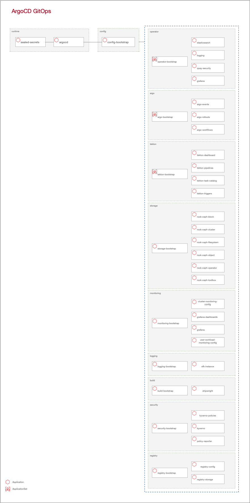

# Install OKD4

< Prerequisite: [Provision infrastructure](02_provision_infrastructure.md)

* * *

Let's start with the fun part!

- Project Quay Access/Application Token
- Red Hat/DockerHUB pull secrets
- Choose OKD and FCOS version
- Setup installation environment
- Start installation
- Complete installation
- Verify installation
- Day-1 with Ansible
- Day-1 with GitOps
- Destroy or reinstall

## Project Quay Access/Application Token

An Access and Application Token is required to gain access to Project Quay's API and repositories. Let's [create one](quay.md)!

```json
[lab@lab ~/github/okd-lab/.secrets/pull-secret.json]

{
  "auths": {
    "quay.okd.example.com": {
      "auth": "quay_okd_example_com_auth",
      "email": "lab@okd.example.com"
    }
  }
}
```

## Red Hat/DockerHUB pull secrets

To save time it's best to prepare all needed pull secrets in advance.

### Red Hat

Installing operators from Red Hat's OpenShift OperatorHUB requires a valid pull secret. Register for a [free Red Hat Account](https://sso.redhat.com/auth/realms/redhat-external/login-actions/registration?client_id=cloud-services&tab_id=lmZzZI3bBdU) and point your browser to [Red Hat OpenShift cluster manager portal](https://cloud.redhat.com/openshift/install/azure/aro-provisioned) and select `Copy pull secret`. It's recommended to start a free `Self-managed OpenShift trial` for 60 days. After 60 days you still have access to the OperatorHUB catalog. 

Merge your secret with the existing pull secret and remove the `cloud.openshift.com` entry, if you don't want to send telemetry data about your OKD cluster to Red Hat.


```json
[lab@lab ~/github/okd-lab/.secrets/pull-secret.json]

{
  "auths": {
    "quay.okd.example.com": {
      "auth": "quay_okd_example_com_auth",
      "email": "lab@okd.example.com"
    },
    "quay.io": {
      "username": "quay_io_username",
      "password": "quay_io_password",
      "auth": "quay_io_auth",
      "email": "quay_io_email"
    },
    "registry.connect.redhat.com": {
      "username": "registry_connect_redhat_com_username",
      "password": "registry_connect_redhat_com_password",
      "auth": "registry_connect_redhat_com_auth",
      "email": "registry_connect_redhat_com_email"
    },
    "registry.redhat.io": {
      "username": "registry_redhat_io_username",
      "password": "registry_redhat_io_password",
      "auth": "registry_redhat_io_auth",
      "email": "registry_redhat_io_email"
    }
  }
}
```

### Expand DockerHub rate limit

It's possible that you reach Docker's rate limit for anonymous access when you move forward. Create a [personal access token](https://docs.docker.com/docker-hub/access-tokens/) in your DockerHub account and convert it to base64 for the auth field in the secret. Again merge your secret with the existing pull secret.

```json
[lab@lab]

echo -n 'your_docker_token' | base64

[lab@lab ~/github/okd-lab/.secrets/pull-secret.json]

{
  "auths": {
    "quay.okd.example.com": {
      "auth": "quay_okd_example_com_auth",
      "email": "lab@okd.example.com"
    },
    "quay.io": {
      "username": "quay_io_username",
      "password": "quay_io_password",
      "auth": "quay_io_auth",
      "email": "quay_io_email"
    },
    "registry.connect.redhat.com": {
      "username": "registry_connect_redhat_com_username",
      "password": "registry_connect_redhat_com_password",
      "auth": "registry_connect_redhat_com_auth",
      "email": "registry_connect_redhat_com_email"
    },
    "registry.redhat.io": {
      "username": "registry_redhat_io_username",
      "password": "registry_redhat_io_password",
      "auth": "registry_redhat_io_auth",
      "email": "registry_redhat_io_email"
    },
    "docker.io": {
      "username": "docker_io_username",
      "password": "docker_io_password",
      "auth": "docker_io_auth",
      "email": "docker_io_email"
    }
  }
}
```

## Choose OKD and FCOS version

It's time to decide which version to install. The initial settings should be kept during the first installation.

```yaml

    # OKD installation version
    okd_lab_install_okd_version: 4.8.0-0.okd-2021-10-24-061736

    # Fedora CoreOS installation version and stream
    okd_lab_install_fcos_stream: 'stable' 
    okd_lab_install_fcos_version: '34.20210626.3.1'

```

## Tested versions

| OKD  | Fedora CoreOS |
|---|---|
| 4.7.0-0.okd-2021-03-07-090821  | stable/33.20210201.3.0  |
| 4.7.0-0.okd-2021-04-24-103438  | stable/33.20210328.3.0  |
| 4.7.0-0.okd-2021-08-22-163618  | stable/34.20210626.3.1  |
| 4.8.0-0.okd-2021-10-10-030117  | stable/34.20210626.3.1  |
| 4.8.0-0.okd-2021-10-24-061736  | stable/34.20210626.3.1  |

## Setup installation environment

Setting up an installation environment is the first step during OKD installations. 

The simplified workflow to prepare a installation environment is as follows:

- Setup installation environment
  * Download and install `oc client`
  * Prepeare secrets
  * Prepare `install-config.yaml`
  * Download and install `installer`
  * Generate and publish `ignition` files
- Mirror Fedora CoreOS and OKD Mirror Registry
- Prepare installer to use the OKD Mirror Registry
- Collect `kubeadmin` password

```bash
[lab@lab]

# Setup OKD installation environment
ansible-playbook -i bastion, ~/github/okd-lab/ansible/okd/setup.yml --tags env-setup

# Mirror Fedorea CoreOS, PXE's and Registry Mirror
ansible-playbook -i bastion, ~/github/okd-lab/ansible/okd/mirror.yml --tags mirror

# Setup OKD Installer to use Registry Mirror
ansible-playbook -i bastion, ~/github/okd-lab/ansible/okd/setup.yml --tags installer-setup

# Let's grab the kubeadmin password for later
ssh lab@bastion "cat ~/installer/auth/kubeadmin-password" > ~/github/okd-lab/.secrets/kubeadmin

```

Verify installation environment:

* Point your Firefox to [https://quay.okd.example.com/repository/](https://quay.okd.example.com/repository/). Login as user `lab` with password `lab` and check that you have a `okd` organization with a mirrored repository.
* Point your Firefox to [http://mirror.okd.example.com](http://mirror.okd.example.com) and check you find a `ignition` and `fcos` directory.

## Start installation

You can provision `bootstrap`, `master` and `worker` nodes all at the same time and wait for cluster to complete. The strength is to be found in serenity :-)

```bash
[lab@lab]

# Apply (provision) Cluster with Terraform
ansible-playbook ~/github/okd-lab/ansible/okd/cluster.yml --tags apply

```

Please note! Under rare circumstances some `bootstrap`, `master` and `worker` nodes may not boot immediately. If this happens, remove the `cluster` and start the installlation again. Help welcome to find a fix!

```bash
[lab@lab]

# Destroy (unprovision) Cluster with Terraform
ansible-playbook ~/github/okd-lab/ansible/okd/cluster.yml --tags destroy

# Apply (provision) Cluster with Terraform
ansible-playbook ~/github/okd-lab/ansible/okd/cluster.yml --tags apply

```

## Complete installation

 - Waiting bootstrap to complete
 - Waiting installation to complete
 - Approve certificate signing requests (csr) and join workers
 - Apply NTP (chrony) configuration

```bash
[lab@lab]

# Complete OKD installation
ansible-playbook -i bastion, ~/github/okd-lab/ansible/okd/okd.yml --tags complete

```

### Follow HAProxy stats (optional)

 * Point your Firefox to [https://lb.okd.example.com:9000](https://lb.okd.example.com:9000) and watch the stats.

### Follow cluster operators and nodes (optional)

This will take some minutes until you get the first response from the `bootstrap` node.

```bash

[lab@bastion]

watch -n2 oc get clusteroperators

oc get nodes --watch=true

```

### Remove `bootstrap` node (optional)

After the `Waiting bootstrap to complete` task has finished it's save to remove the `bootstrap` (e.g. in a second terminal).

```bash
[lab@lab]

# Destroy Bootstrap with Terraform
ansible-playbook ~/github/okd-lab/ansible/okd/cluster.yml --tags bootstrap-destroy

```

## Verify installation

### Verify nodes

It will take some time until all nodes are in `Ready` state but you can already interact with your new cluster. You will recognize that `master` and `worker` nodes will switch to `NotReady,SchedulingDisabled` state. This is intentional cause NTP time synchronization will be applied to all nodes after initial installation. The strength again is to be found in serenity. 

Attention! If you like to login right now, please use the `kubeadmin` user only at this point in time!

```bash
[lab@lab]

ssh lab@bastion "oc get nodes"

or

[lab@bastion ~]# oc get nodes

NAME                       STATUS   ROLES                 AGE   VERSION
master-0.okd.example.com   Ready    infra,master,worker   95m   v1.21.2+6438632-1505
master-1.okd.example.com   Ready    infra,master,worker   95m   v1.21.2+6438632-1505
master-2.okd.example.com   Ready    infra,master,worker   95m   v1.21.2+6438632-1505
worker-0.okd.example.com   Ready    infra,worker          75m   v1.21.2+6438632-1505
worker-1.okd.example.com   Ready    infra,worker          75m   v1.21.2+6438632-1505
worker-2.okd.example.com   Ready    infra,worker          75m   v1.21.2+6438632-1505

```

## Day-1 with Ansible

Apply some basic configurations with Ansible (imperativ): 

- Label `master` and `worker` as `infra` nodes
- Stick routers to `master` nodes
- Enable Image Pruner
- Disable Samples Operator
- Manage internal Registry and add some temporary storage
- Enable LDAP authorization provider
- Create `admin` and `lab` user within the cluster-admin role
- Create `admins`, `awesome-admins` and `awesome-developers` groups
- Enable Community and Red Hat operator catalogs in OpertorHUB
- Apply trusted custom Certificate Authority and SSL certificates for Web console, Router and API
- Expand system reserved memory to 3Gi on `master` nodes

More cluster configurations and software installations (storage, logging, monitoring, pipelines, security etc.) follows gitops principals (declarative), documented later in this installation guide. 

Let's go ahead with Anisble....

```bash
[lab@lab]

# Day-1 OKD configurations with Ansible
ansible-playbook -i bastion, ~/github/okd-lab/ansible/okd/okd.yml --tags config

```

Wait until the playbook completes and inspect your cluster operators and nodes again.

```bash

[lab@bastion]

watch -n2 oc get clusteroperators

```

The change of SSL certificates for the API will bring up an error: `Unable to connect to the server: x509: certificate signed by unknown authority` after a few minutes. Wait until this error stays "forever" in your terminal! This will take some time!

After that, point your Firefox to OKD Web Console at [https://console-openshift-console.apps.okd.example.com](https://console-openshift-console.apps.okd.example.com) and `LDAP` login with user `lab` and password `lab`.

Click on your `lab` user and choose `Copy login command`, than choose `Display Token`. Copy `Your API token is` to `XXXXXXXXXX` in the following command and login again. 

```bash

[lab@bastion]

oc login --token=XXXXXXXXXX --server=https://api.okd.example.com:6443 --certificate-authority=/etc/ca.crt

```

Now you can interact with the API again. Just wait a few more minutes until all cluster operators are in `Available` state and no longer `Processing` or `Degraded`.

```bash

[lab@bastion]

watch -n2 oc get clusteroperators

NAME                                       VERSION                         AVAILABLE   PROGRESSING   DEGRADED   SINCE
authentication                             4.8.0-0.okd-2021-10-24-061736   True        False         False      42m
baremetal                                  4.8.0-0.okd-2021-10-24-061736   True        False         False      92m
cloud-controller-manager                   4.8.0-0.okd-2021-10-24-061736   True        False         False      93m
cloud-credential                           4.8.0-0.okd-2021-10-24-061736   True        False         False      94m
cluster-autoscaler                         4.8.0-0.okd-2021-10-24-061736   True        False         False      92m
config-operator                            4.8.0-0.okd-2021-10-24-061736   True        False         False      93m
console                                    4.8.0-0.okd-2021-10-24-061736   True        False         False      43m
csi-snapshot-controller                    4.8.0-0.okd-2021-10-24-061736   True        False         False      93m
dns                                        4.8.0-0.okd-2021-10-24-061736   True        False         False      92m
etcd                                       4.8.0-0.okd-2021-10-24-061736   True        False         False      92m
image-registry                             4.8.0-0.okd-2021-10-24-061736   True        False         False      6m5s
ingress                                    4.8.0-0.okd-2021-10-24-061736   True        False         False      89m
insights                                   4.8.0-0.okd-2021-10-24-061736   True        False         False      86m
kube-apiserver                             4.8.0-0.okd-2021-10-24-061736   True        False         False      88m
kube-controller-manager                    4.8.0-0.okd-2021-10-24-061736   True        False         False      91m
kube-scheduler                             4.8.0-0.okd-2021-10-24-061736   True        False         False      88m
kube-storage-version-migrator              4.8.0-0.okd-2021-10-24-061736   True        False         False      41m
machine-api                                4.8.0-0.okd-2021-10-24-061736   True        False         False      93m
machine-approver                           4.8.0-0.okd-2021-10-24-061736   True        False         False      92m
machine-config                             4.8.0-0.okd-2021-10-24-061736   True        False         False      92m
marketplace                                4.8.0-0.okd-2021-10-24-061736   True        False         False      92m
monitoring                                 4.8.0-0.okd-2021-10-24-061736   True        False         False      86m
network                                    4.8.0-0.okd-2021-10-24-061736   True        False         False      93m
node-tuning                                4.8.0-0.okd-2021-10-24-061736   True        False         False      47m
openshift-apiserver                        4.8.0-0.okd-2021-10-24-061736   True        False         False      88m
openshift-controller-manager               4.8.0-0.okd-2021-10-24-061736   True        False         False      12m
openshift-samples                          4.8.0-0.okd-2021-10-24-061736   True        False         False      47m
operator-lifecycle-manager                 4.8.0-0.okd-2021-10-24-061736   True        False         False      92m
operator-lifecycle-manager-catalog         4.8.0-0.okd-2021-10-24-061736   True        False         False      92m
operator-lifecycle-manager-packageserver   4.8.0-0.okd-2021-10-24-061736   True        False         False      43m
service-ca                                 4.8.0-0.okd-2021-10-24-061736   True        False         False      93m
storage                                    4.8.0-0.okd-2021-10-24-061736   True        False         False      93m

```

### Play around

Time to [login to your new OKD cluster](https://console-openshift-console.apps.okd.example.com). See [Appendix](appendix.md) for URL's, users and passwords.

## Day-1 with GitOps

It's time to switch to GitOps style for further configurations.

### Prepare GitLab SSH Key and Access Token

An SSH key and Access Token is required to gain access to GitLab's API and repositories. Let's [create one](gitlab.md)!

### Import `okd-lab` repository into local GitLab

To start your own GitOps experience it's recommended to use your own local GitLab installation.

The following Ansible playbook will:

* Prepare `.gitconfig` for `lab` user
* Create a new public git repository in GitLab at `https://gitlab.okd.example.com/lab/okd-lab.git`
* Create a new directory `~/gitlab/`
* Clone `ssh://git@gitlab.okd.example.com:2222/lab/okd-lab.git` to `~/gitlab/okd-lab`
* Sync `~/github/okd-lab` to `~/gitlab/okd-lab`
* Commit and push `~/gitlab/okd-lab` to `https://gitlab.okd.example.com/lab/okd-lab.git`

```bash
[lab@lab]

# Import okd-lab repository into Gitlab 
ansible-playbook ~/github/okd-lab/ansible/lab/git-import.yml

```

### Share `okd-lab` repository between `lab` and `bastion` 

Share `~/gitlab` directories using SSHFS.

```bash
[lab@bastion]

# Share okd-lab git repository with `bastion`
sshfs -o "StrictHostKeyChecking=no" lab@10.0.0.1:/home/lab/gitlab ~/gitlab

# Check
ls -la ~/gitlab/okd-lab

```

From now it's save to work on the `bastion` host to start OKD cluster configurations and application installations with GitOps.

### Install GitOps runtime and initiate config-bootstrap process

```bash
[lab@bastion]

# Login to OKD with password 'lab'
oc login -u lab  --certificate-authority=/etc/ca.crt

# Apply ArgoCD and intial cluster configuration and application installation
oc apply -f ~/gitlab/okd-lab/gitops/cluster/runtime/install.yaml

# Execute twice!
oc apply -f ~/gitlab/okd-lab/gitops/cluster/runtime/install.yaml

```

Now starts the GitOps magic.

The `install.yaml` from the previously command is the result of:

```bash
[lab@bastion]

cd ~/gitlab/okd-lab/gitops/cluster/runtime

kustomize build install/ >> install.yaml

```

This installs ArgoCD and Sealed Secrets as the GitOps runtime with some customizations e.g. ArgoCD OAuth with OpenShift.
Next the previously in GitLab imported `okd-lab` repository will be available to ArgoCD and a `config-bootstrap` process starts to configure the OKD cluster and installs some applications. ArgoCD and Sealed Secrets will be self managed by ArgoCD in the end. 

Following diagram for a quick overview, what will be installed right now. 



Inspect `okd-lab/gitops` for more details. You need a basic understanding of GitOps, ArgoCD and kustomize.

To follow the config-bootstrap process, point your Firefox to the ArgoCD [namespace](https://console-openshift-console.apps.okd.example.com/k8s/ns/argocd/pods) and wait until all pods are in running state.

Then visit the [ArgoCD login page](https://argocd.apps.okd.example.com) and `Login via OpenShift` with user `lab` and password `lab`.

Some additional good places to watch the progress are:
- [OKD Dashboard](https://console-openshift-console.apps.okd.example.com/dashboards)
- [Rook storage](https://console-openshift-console.apps.okd.example.com/k8s/ns/rook-ceph/pods)
- [Persistent Volume Claims](https://console-openshift-console.apps.okd.example.com/k8s/all-namespaces/persistentvolumeclaims)

If all has finished, grep the Rook Ceph Dashboard `admin` password for later.

```bash
[lab@bastion]

# Grep Rook Ceph Dashboard password for user 'admin'
oc -n rook-ceph get secret rook-ceph-dashboard-password -o jsonpath="{['data']['password']}" | base64 --decode >> ~/gitlab/okd-lab/.secrets/rook-ceph-dashboard-password

```

### Play more around

Time to login to your new applications. See [Appendix](appendix.md) for URL's, users and passwords.

To interact with your new cluster following CLI's are available on `bastion` host:
* [K9S](https://k9scli.io/)
* [Kustomize](https://kustomize.io/)
* [Helm](https://helm.sh/)
* [ArgoCD](https://github.com/argoproj/argo-cd)
* [Argo Workflows](https://github.com/argoproj/argo-workflows)
* [Argo Events](https://github.com/argoproj/argo-events)
* [Argo Rollouts](https://github.com/argoproj/argo-rollouts)
* [Tekton Pipelines](https://github.com/tektoncd/cli)
* [Sealed Secrets](https://github.com/bitnami-labs/sealed-secrets)
* [Kyverno](https://github.com/kyverno/kyverno/)

Please take a look at available [home directory structures](homes.md) at `bastion` and `lab` hosts.

## Destroy or reinstall

After so much work it's always hard, but prepare to do so. You will see, a new installation does not take to long!

### Reinstall same OKD4 version

A typical workflow if you already have OKD installed but you want to reinstall with the same version:

```bash
[lab@lab]

# Destroy (unprovision) Cluster with Terraform
ansible-playbook ~/github/okd-lab/ansible/okd/cluster.yml --tags destroy

# Cleanup OKD installation environment
ansible-playbook -i bastion, ~/github/okd-lab/ansible/okd/setup.yml --tags env-cleanup

# Cleanup Fedora CoreOS, PXE's and Registry Mirrors
ansible-playbook -i bastion, ~/github/okd-lab/ansible/okd/mirror.yml --tags cleanup

# Setup OKD installation environment
ansible-playbook -i bastion, ~/github/okd-lab/ansible/okd/setup.yml --tags env-setup

# Mirror Fedora CoreOS, PXE's and Registry
ansible-playbook -i bastion, ~/github/okd-lab/ansible/okd/mirror.yml --tags mirror

# Setup OKD Installer to use Registry Mirror
ansible-playbook -i bastion, ~/github/okd-lab/ansible/okd/setup.yml --tags installer-setup

# Remember kubeadmin password
ssh lab@bastion "cat ~/installer/auth/kubeadmin-password" > ~/github/okd-lab/.secrets/kubeadmin

# Apply (provision) Cluster with Terraform
ansible-playbook ~/github/okd-lab/ansible/okd/cluster.yml --tags apply

# In case the a VM will not boot the first time, just destroy and apply again
ansible-playbook ~/github/okd-lab/ansible/okd/cluster.yml --tags destroy
ansible-playbook ~/github/okd-lab/ansible/okd/cluster.yml --tags apply

# Complete OKD installation
ansible-playbook -i bastion, ~/github/okd-lab/ansible/okd/okd.yml --tags complete

# Destroy Bootstrap with Terraform
ansible-playbook ~/github/okd-lab/ansible/okd/cluster.yml --tags bootstrap-destroy

# Day-1 OKD configurations with Ansible
ansible-playbook -i bastion, ~/github/okd-lab/ansible/okd/okd.yml --tags config
```

### Reinstall different OKD4 version

You're free to decide which version to install (including [nightlies](https://origin-release.svc.ci.openshift.org/)). With UPI it's also possible to choose the Fedora CoreOS version.

A typical workflow if you already have a cluster installed but you want to reinstall with a different version:

```bash
[lab@lab]

# Destroy (unprovision) Cluster with Terraform
ansible-playbook ~/github/okd-lab/ansible/okd/cluster.yml --tags destroy

# Cleanup OKD installation environment
ansible-playbook -i bastion, ~/github/okd-lab/ansible/okd/setup.yml --tags env-cleanup

# Cleanup Fedora CoreOS, PXE's and Registry Mirrors
ansible-playbook -i bastion, ~/github/okd-lab/ansible/okd/mirror.yml --tags cleanup

# Change your versions
[ lab@lab ~/github/okd-lab/ansible/vars/vars.yaml ]

    # OKD installation version
    okd_lab_install_okd_version: '4.8.0-0.okd-2021-10-24-061736'

    # Fedora CoreOS installation version and stream
    okd_lab_install_fcos_stream: 'stable' 
    okd_lab_install_fcos_version: '34.20210626.3.1'

# Setup OKD installation environment
ansible-playbook -i bastion, ~/github/okd-lab/ansible/okd/setup.yml --tags env-setup

# Mirror Fedora CoreOS, PXE's and Registry
ansible-playbook -i bastion, ~/github/okd-lab/ansible/okd/mirror.yml --tags mirror

# Setup OKD Installer to use Registry Mirror
ansible-playbook -i bastion, ~/github/okd-lab/ansible/okd/setup.yml --tags installer-setup

# Remember kubeadmin password
ssh lab@bastion "cat ~/installer/auth/kubeadmin-password" > ~/github/okd-lab/.secrets/kubeadmin

# Apply (provision) Cluster with Terraform
ansible-playbook ~/github/okd-lab/ansible/okd/cluster.yml --tags apply

# In case the a VM will not boot the first time, just destroy and apply again
ansible-playbook ~/github/okd-lab/ansible/okd/cluster.yml --tags destroy
ansible-playbook ~/github/okd-lab/ansible/okd/cluster.yml --tags apply

# Complete OKD installation
ansible-playbook -i bastion, ~/github/okd-lab/ansible/okd/okd.yml --tags complete

# Destroy Bootstrap with Terraform
ansible-playbook ~/github/okd-lab/ansible/okd/cluster.yml --tags bootstrap-destroy

# Day-1 OKD configurations with Ansible
ansible-playbook -i bastion, ~/github/okd-lab/ansible/okd/okd.yml --tags config

```

### Destroy OKD4

```bash
[lab@lab]

ansible-playbook ~/github/okd-lab/ansible/okd/cluster.yml --tags destroy

```
