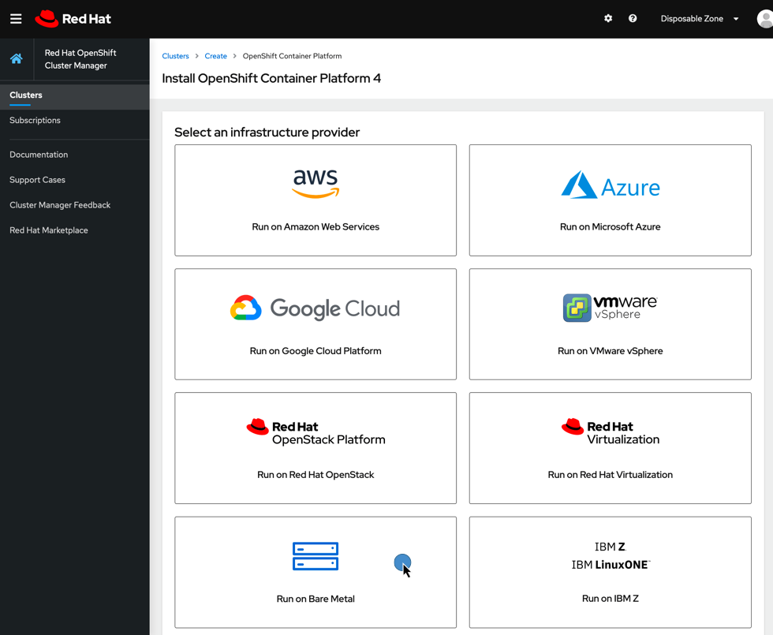
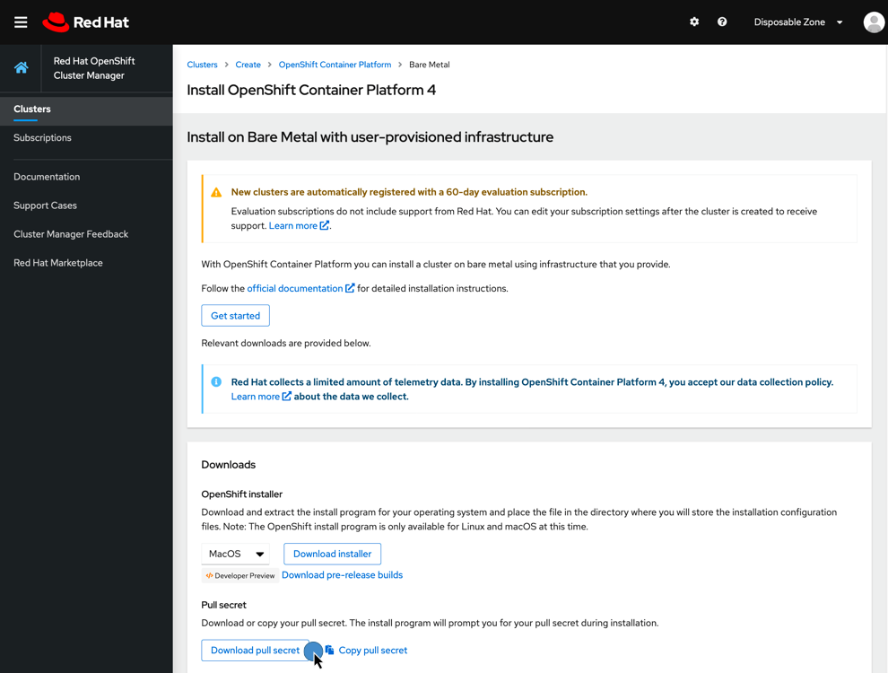

# Red Hat pull secret

< [Install OKD4](03_install_okd.md)

* * *

Login to [Red Hat Cluster Manager](https://cloud.redhat.com/openshift/install) portal and obtain a pull secret. Choose `Run on Bare Metal`. If you don't have an account just register for a new one. It's free of charge!

Download pull secret and save it as:

`[ lab@lab ~/okd-lab/.secrets/redhat-pull-secret.json ]`
