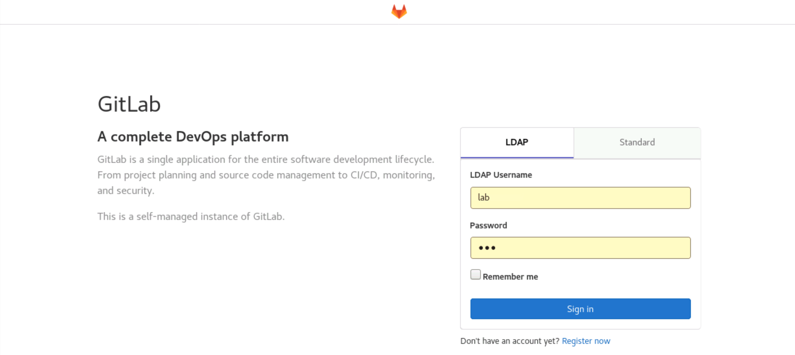
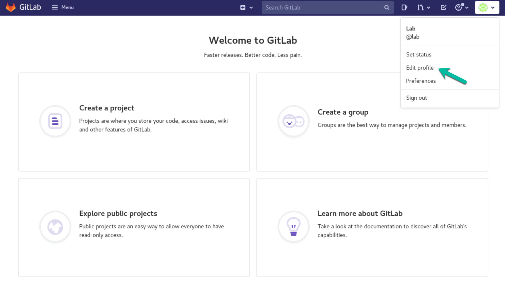
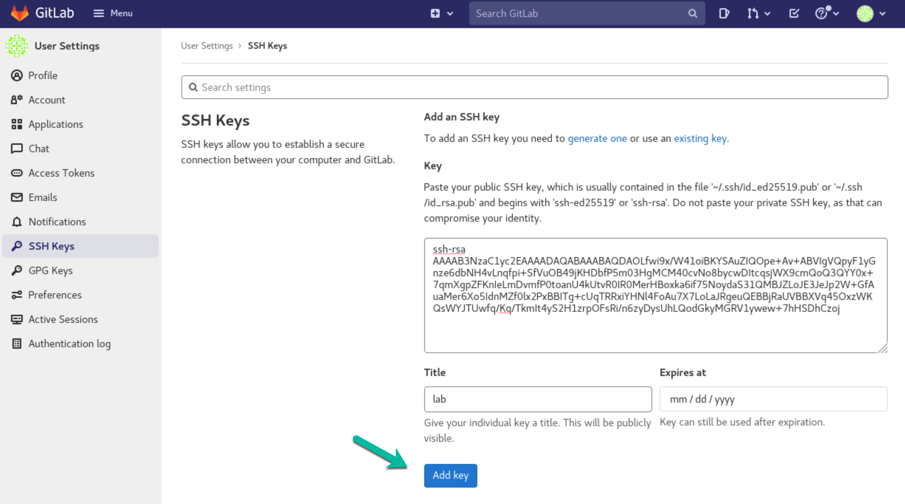
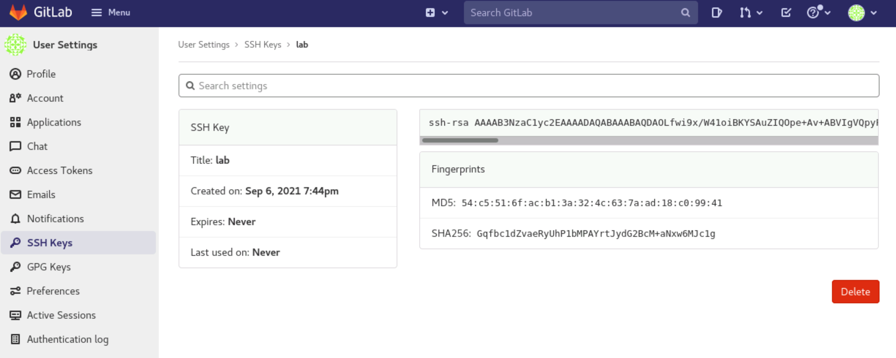
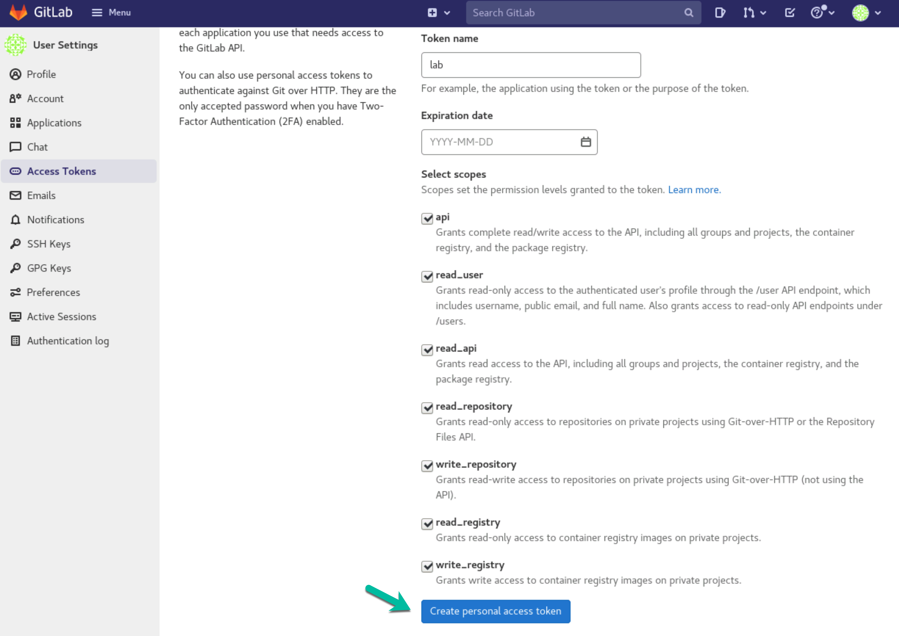
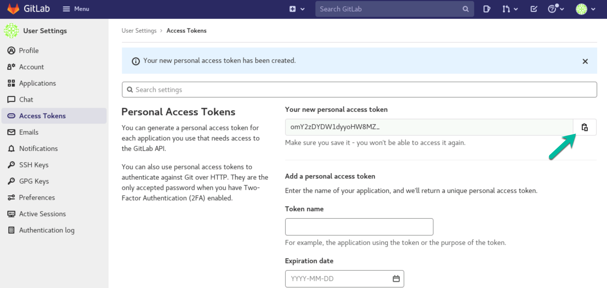
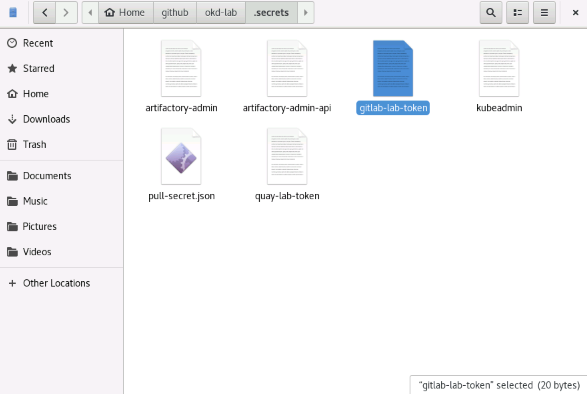

# GitLab SSH Keys and Access Token

< [Install OKD4](03_install_okd.md)

* * *

Point your Firefox to [https://gitlab.okd.example.com](https://gitlab.okd.example.com) and login via `LDAP` as user `lab` with password `lab`.

## Edit profile 

### Add SSH key 

Add user `lab` SSH public key from `~/.ssh/id_rsa.pub`

### Create Access Token

Create a new personal access token and save it for further usage.

### Save Access Token

