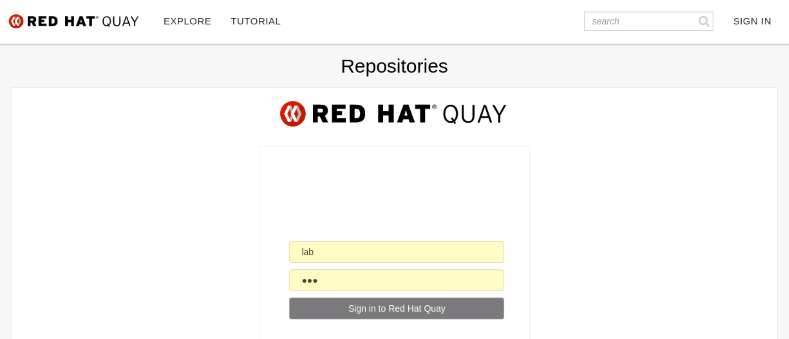

# Quay Token

< [Install OKD4](03_install_okd.md)

* * *

Point your Firefox to [https://quay.okd.example.com](https://quay.okd.example.com) and login as user `lab` with password `lab`.

## Create New Organization 

## Create New Application

## Generate Access Token

## Save Access Token

Tip: Press Ctl+H to show hidden files.

## Create Application Token

## Save Application Token

